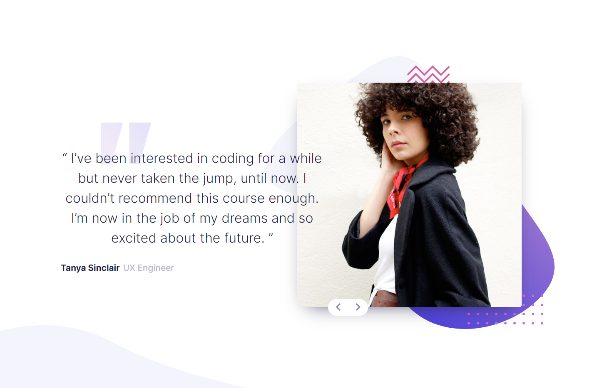
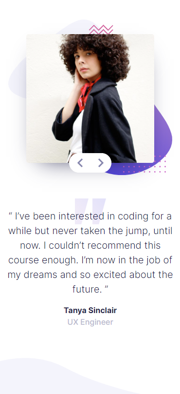
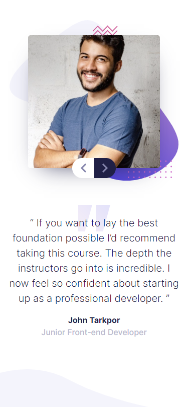

# Frontend Mentor - Coding bootcamp testimonials slider solution

This is a solution to the [Coding bootcamp testimonials slider challenge on Frontend Mentor](https://www.frontendmentor.io/challenges/coding-bootcamp-testimonials-slider-4FNyLA8JL). Frontend Mentor challenges help you improve your coding skills by building realistic projects.

## Table of contents

- [Overview](#overview)
  - [The challenge](#the-challenge)
  - [Screenshot](#screenshot)
  - [Links](#links)
- [My process](#my-process)
  - [Built with](#built-with)
  - [What I learned](#what-i-learned)
  - [Continued development](#continued-development)
  - [Useful resources](#useful-resources)
- [Author](#author)

## Overview

### The challenge

Users should be able to:

- View the optimal layout for the component depending on their device's screen size
- Navigate the slider using either their mouse/trackpad or keyboard

### Screenshot





### Links

- Solution URL: [https://www.frontendmentor.io/solutions/coding-bootcamp-testimonials-slider-xMcHGYVRB]
- Live Site URL: [https://bootcamp-testimonials-slider-omega.vercel.app/]
- GitHub Repo: [https://github.com/JaJamaRu14/bootcamp-testimonials-slider.git]

## My process

### Built with

- Semantic HTML5 markup
- CSS custom properties
- Flexbox
- CSS Grid
- SCSS
- Bootstrap
- Vanilla JS

### What I learned

Making the page fully responsive is still one of the toughest challenges for me.
Using magic css numbers like "top: 76px" and "left: 189px" is not a great way to style things but I have used them in this project.
I would need to research more on responsive design and try avoiding bad css practices.
There are only limited JS so I was able to get it thorough.

This was my first time implementing SCSS and I definitely need to keep learning it.

\_breakpoins.scss, \_mixin.scss, and main.scss

```css
$breakpoints: (
  'sm': 'screen and (max-width: 400px)',
  'md': 'screen and (max-width: 768px)',
  'lg': 'screen and (max-width: 1000px)',
  'xl': 'screen and (max-width: 1200px)',
) !default;

@mixin mq($breakpoint) {
  @media #{map-get($breakpoints, $breakpoint)} {
    @content;
  }
}

.person {
  font-size: 1.3rem;
  margin-top: 1rem;

  @include mq(md) {
    font-size: 1rem;
    margin-top: 0;
    display: flex;
    flex-direction: column;
    justify-content: center;
    text-align: center;
  }

  .name {
    margin-right: 0.5rem;
    font-weight: 700;

    @include mq(md) {
      margin-right: 0;
    }
  }

  .job-title {
    color: $gray-blue;
    font-weight: 500;
  }
}
```

Setting testimonial obj and iterating over it to change the testimonials on click

```js
const testimonials = [
  {
    username: 'Tanya Sinclair',
    jobTitle: 'UX Engineer',
    comment:
      '  “ I’ve been interested in coding for a while but never taken the jump, until now. I couldn’t recommend this course enough. I’m now in the job of my dreams and so excited about the future. ” ',
    picture: './images/image-tanya.jpg',
  },
  {
    username: 'John Tarkpor',
    jobTitle: 'Junior Front-end Developer',
    comment:
      ' “ If you want to lay the best foundation possible I’d recommend taking this course. The depth the instructors go into is incredible. I now feel so confident about starting up as a professional developer. ” ',
    picture: './images/image-john.jpg',
  },
];

btns.forEach(function (btn) {
  btn.addEventListener('click', () => {
    switchTestimonial();
  });
});

let num = 1;
function switchTestimonial() {
  if (num >= testimonials.length) {
    num = 0;
  }
  comment.innerText = testimonials[num].comment;
  username.innerText = testimonials[num].username;
  jobTitle.innerText = testimonials[num].jobTitle;
  picture.src = testimonials[num].picture;

  num++;
}
```

### Continued development

I would like to continue learning JS and useful libraries such as React, Vue, and Node etc.

### Useful resources

- [Sass Media Query best practice](https://zenn.dev/web_tips/articles/095d7419507ca9) - This helped me for learning sass media queries and its best practice.
- [Box shadow samples](https://saruwakakun.com/html-css/basic/box-shadow) - This is a good resource for box-shadow samples.
- [Button designs](https://jajaaan.co.jp/css/button/) - This is a good resource for button designs.

## Author

- codepen - [@JaJamaRu](https://codepen.io/JaJamaRu)
- Frontend Mentor - [@JaJamaRu14](https://www.frontendmentor.io/profile/JaJamaRu14)
- Twitter - [@shotime_14](https://twitter.com/shotime_14)
